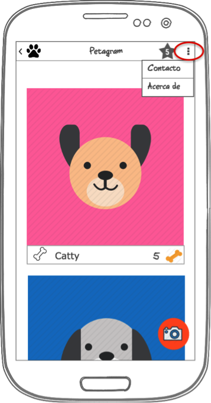
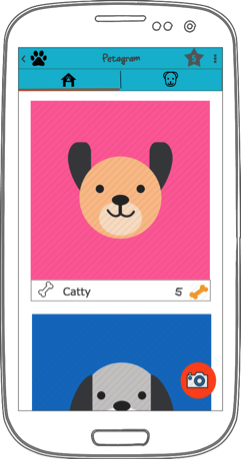
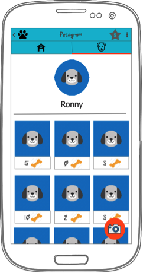

# Menús y Fragments - Petagram
Partiendo de tu proyecto anterior deberás agregarle Menús y Fragments. 

AGREGANDO MENÚS:

   1  Crea un menú de opciones que muestre el Item “Contacto” y el Item “Acerca De”
   
    API 19  API30 
   
Contacto deberá:

    -Llevarte a una pantalla con un formulario en el que solicites el nombre, el correo y su mensaje 
      (utiliza los EditText de Material Design), 
    -Además habrá un botón de “Enviar Comentario” el cual tomará la información recopilada y con 
    ayuda de la librería JavaMail envíe un mail con el comentario del contacto.
    
   API19 API30

Este es el enlace con la documentación de JavaMail: https://java.net/projects/javamail/pages/Android

Acerca De, deberá llevarte a una pantalla con la Bio del desarrollador.

API19 API30 

FRAGMENTS

A partir de la siguiente imagen de maqueta: 

  1. Modulariza el proyecto anterior en Fragments para que estos puedan ser mostrados en un ViewPager.
  
   API19 API30 
  
   API19 API30 
  
  2. Crea un Fragment Adicional que muestre el perfil de nuestra mascota. Tendrá su foto de perfil, 
  su nombre y un RecyclerView en donde se mostrarán todas las fotos que ha subido se acomodarán en forma de Grid. 
  3. Cada ítem deberá contener la foto y la cantidad de raits que se le han dado representado por huesos. 
  Recuerda que todos los datos son dummy.

Puedes utilizar esta librería para generar una imagen redonda como foto de perfil de la mascota: 
https://github.com/lopspower/CircularImageView  
