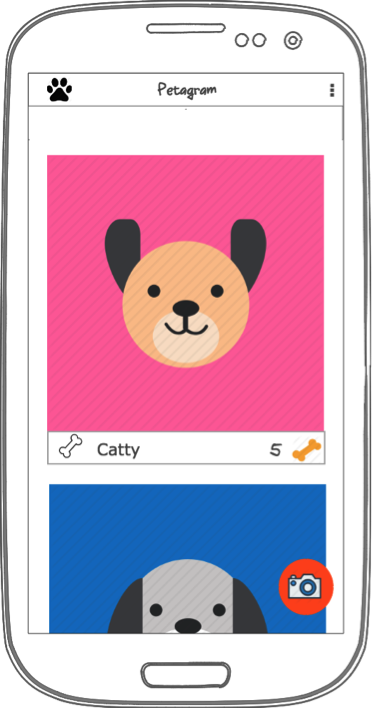
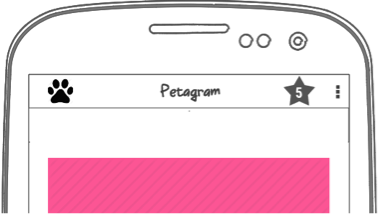
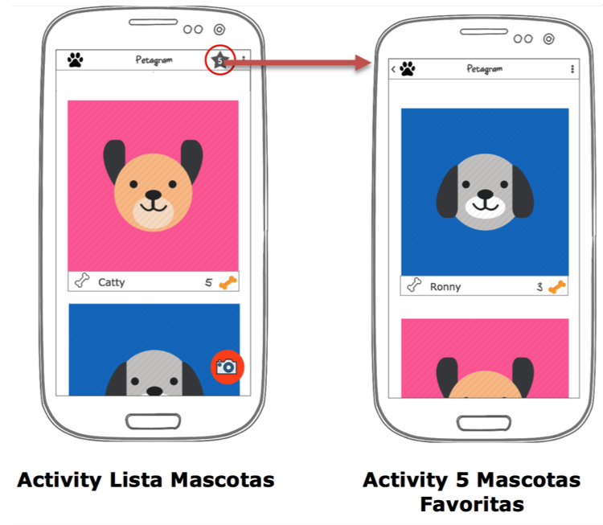

# Menús y Fragments - Petagram
Partiendo de tu proyecto anterior deberás agregarle Menús y Fragments. 

AGREGANDO MENÚS:

   1  Crea un menú de opciones que muestre el Item “Contacto” y el Item “Acerca De”
   
Contacto deberá:

    -Llevarte a una pantalla con un formulario en el que solicites el nombre, el correo y su mensaje (utiliza los EditText de Material Design), 
    -Además habrá un botón de “Enviar Comentario” el cual tomará la información recopilada y con ayuda de la librería JavaMail envíe un mail con el comentario del contacto.

Este es el enlace con la documentación de JavaMail: https://java.net/projects/javamail/pages/Android

Acerca De, deberá llevarte a una pantalla con la Bio del desarrollador.

La siguiente imagen representa una maqueta de una pantalla:

Ahora:

    -Analiza la entidad “Mascota” .
    -Genera un RecyclerView que muestre una lista de mascotas como se observa. 
    -Deberás prevenir que cada mascota puede ser raiteada usando el ícono de hueso en blanco en comparación con el 
     hueso amarillo que nos muestra la cantidad de raiting que tiene cada mascota.

Parte 2

Partiendo de lo realizado en la parte 1:

    Crea un Action View en forma de estrella como el que se muestra en la siguiente imagen:
    

Este botón debe tener las siguientes características:

    -Nos debe llevar a un Nuevo Activity que en el futuro funcionará como una pantalla en la que estaremos 
    almacenando las últimas 5 mascotas que nos han gustado 
    (el ícono de gustar es el indicado por el hueso en blanco). 
    -Para el objetivo de este ejemplo, lo único que deberás mostrar es un RecyclerView con 5 mascotas  
    “Dummy” o Hardcodeadas. 
    -Además, la actividad que muestra las mascotas favoritas, deberá tener la posibilidad de regresar 
    al Activity padre.
    -El flujo de la aplicación deberá ser el que se muestra en las siguientes maquetas: 
    

Resultados Api 19:
Activity Principal:

    

Activity Favoritos:

Video Preview

Resultados Api 30:
Activity Principal:

     

Activity Favoritos:

